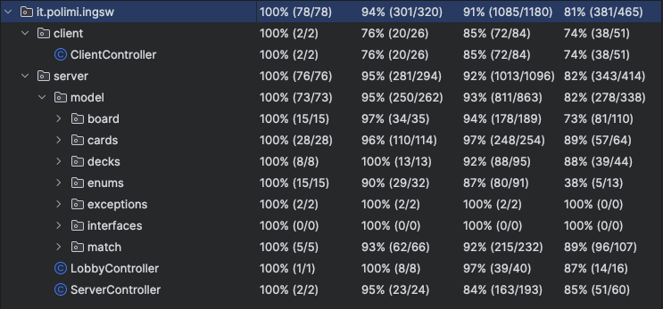

# 🎲 Mesos — Strategic Board Game

> **Software Engineering Final Project** — Politecnico di Milano  
> School of Industrial and Information Engineering  
> Bachelor's Degree in Computer Science and Engineering

**Course:** Ingegneria del Software (Software Engineering)  
**Academic Year:** 2025/2026  
**Grade:** 30/30  


---

## 📋 Overview

Mesos is a **strategic board game** implemented as a **distributed client-server application** in Java. The project was developed for the Software Engineering course final exam, focusing on clean architecture, design patterns, and robust network communication.

The game features a **hybrid network architecture** supporting both **RMI** and **Socket** protocols, allowing clients to connect seamlessly regardless of their preferred transport layer. The server manages multiple concurrent matches, each with its own game state, while clients can interact through either a **graphical user interface (GUI)** or a **text-based terminal interface (TUI)**.

The implementation emphasizes **separation of concerns**, **extensibility**, and **maintainability**, following object-oriented design principles and established software engineering best practices.

---

## ⚙️ Supported Features

| Feature | Description |
|---------|-------------|
| **Multi-Protocol Support** | Clients can connect via RMI or Socket, with automatic protocol detection and adaptation |
| **Dual View System** | Play through a rich JavaFX GUI or a lightweight console-based TUI |
| **Concurrent Matches** | Server handles multiple game sessions simultaneously with isolated state management |
| **Lobby System** | Players can create or join game lobbies, with ready-state synchronization before match start |
| **Game State Persistence** | Match state is maintained server-side with snapshot support for recovery and debugging |
| **Event-Driven Architecture** | Client views update reactively through listener-based event propagation |
| **Comprehensive Testing** | Unit and integration tests cover core logic, network adapters, and protocol messages |
| **Auto-Generated Documentation** | Full Javadoc available for all public APIs and internal components |

### Game Mechanics

- **Players:** 2-4 players compete in each match
- **Objective:** Compete through strategic turns to achieve victory conditions
- **Turn Structure:** Players alternate turns performing actions according to game rules
- **Victory Conditions:** Based on game-specific objectives and scoring

---

## 🔌 Architecture

The system follows a **layered client-server architecture** with clear separation between network, logic, and presentation layers.

### High-Level Components

```text
┌─────────────────────────────────────────────────────────┐
│                      CLIENTS                            │
│  ┌─────────────┐  ┌─────────────┐                       │
│  │  GUI View   │  │  TUI View   │                       │
│  └──────┬──────┘  └──────┬──────┘                       │
│         │                │                              │
│         └────────────────┼                              │
│                          │                              │
│              ┌───────────▼───────────┐                  │
│              │  ClientController     │                  │
│              └───────────┬───────────┘                  │
│                          │                              │
│         ┌────────────────┼────────────────┐             │
│         │                │                │             │
│  ┌──────▼──────┐  ┌──────▼──────┐  ┌──────▼──────┐      │
│  │ RMI Adapter │  │Socket Adapter│ │   Factory   │      │
│  └──────┬──────┘  └──────┬──────┘  └─────────────┘      │
└─────────┼────────────────┼──────────────────────────────┘
          │                │
          │    Network     │
          │  (RMI/Socket)  │
          │                │
┌─────────┼────────────────┼─────────────────────────────┐
│         │                │                             │
│  ┌──────▼────────────────▼──────┐                      │
│  │   HybridServerNetworkAdapter │                      │
│  └──────────────┬───────────────┘                      │
│                 │                                      │
│         ┌───────▼────────┐                             │
│         │ServerController│                             │
│         └───────┬────────┘                             │
│                 │                                      │
│    ┌────────────┼────────────┐                         │
│    │            │            │                         │
│ ┌──▼──┐  ┌──────▼──────┐ ┌──▼──┐                       │
│ │Lobby│  │MatchManager │ │ DB  │                       │
│ │Ctrl │  │  (per match)│ │Layer│                       │
│ └─────┘  └─────────────┘ └─────┘                       │
│                                                        │
│                SERVER                                  │
└────────────────────────────────────────────────────────┘
```

### Main Modules

| Module | Responsibility |
|--------|----------------|
| `client` | Client-side logic, view controllers, and network adapters for RMI/Socket |
| `server` | Server-side logic, lobby management, match orchestration, and database layer |
| `network` | Protocol definitions, message types, and hybrid network adapters |
| `utility` | Shared utilities, logging configuration, and common helpers |

### Design Patterns

The project implements several design patterns to ensure flexibility and maintainability:

- **Adapter Pattern** — Unifies RMI and Socket communication behind a common interface
- **Factory Pattern** — Creates appropriate network adapters based on configuration
- **Observer Pattern** — Event listeners propagate game state changes to views
- **MVC (Model-View-Controller)** — Separates game logic, user interface, and input handling
- **Singleton** — Centralized logging and configuration management

---

## 🏗️ Implementation Details

### Server-Side

The server is built around a **centralized controller architecture**:

- **`ServerController`** — Main entry point, manages server lifecycle, client connections, and delegates to lobby/match components
- **`LobbyController`** — Handles lobby creation, player registration, and ready-state synchronization
- **`MatchManager`** — One instance per active match, manages game state, turn progression, and rule enforcement
- **`HybridServerNetworkAdapter`** — Abstracts RMI and Socket protocols, routing messages appropriately
- **`ServerNotifier`** — Broadcasts state updates to all connected clients in a match
- **`ServerLogger`** — Centralized logging for debugging and monitoring

The server maintains **isolated match state** for each game session, ensuring that concurrent matches do not interfere with each other.

### Client-Side

The client supports **dual view modes** with shared controller logic:

- **`ClientController`** — Central client logic, handles user input, communicates with server, and updates views
- **`UIHandler`** — Abstracts view-specific operations, allowing seamless switching between GUI and TUI
- **`GUI` Package** — JavaFX-based graphical interface with interactive game board and animations
- **`TUI` Package** — Console-based text interface for lightweight gameplay
- **`GameEventListener`** — Listener interface for reactive UI updates on game events

### Network Layer

The network layer provides **protocol transparency**:

- **`CommunicationProtocol`** — Defines message types and protocol constants
- **`ClientNetworkAdapter`** — Client-side network abstraction supporting RMI and Socket
- **`ServerNetworkAdapter`** — Server-side interface for client communication
- **`NetworkAdapterFactory`** — Factory for creating appropriate adapters based on configuration
- **Message Classes** — Typed message objects for all protocol commands and responses

### Database Layer

The server includes a **database abstraction layer** for persistent storage:

- Player statistics and match history
- Game configuration and settings
- Snapshot recovery support

---

## 🧪 Testing & Quality

The project includes a **comprehensive test suite** covering:

| Test Category | Coverage |
|---------------|----------|
| **Unit Tests** | Core game logic, model classes, utility functions |
| **Integration Tests** | Network adapters, protocol messages, client-server communication |
| **Mock Objects** | Simulated network conditions and edge cases |

### Test Coverage



The test suite ensures that critical components are validated under various scenarios, including:
- Normal gameplay flow
- Network disconnections and reconnections
- Invalid inputs and edge cases
- Concurrent player actions

---

## 📊 Deliverables

The project includes the following deliverables:

| Deliverable | Location | Description |
|-------------|----------|-------------|
| **High-Level UML** | `deliverables/HighLevelUML.png` | System architecture overview |
| **Detailed UML** | `deliverables/DetailedUML/` | Class diagrams, sequence diagrams, and state machines |
| **Protocol Documentation** | `deliverables/Documentation/ProtocolDocumentation.pdf` | Network protocol specification |
| **Sequence Diagrams** | `deliverables/Documentation/SequenceDiagrams/` | Interaction diagrams for key use cases |
| **Javadoc** | `deliverables/Javadoc/` | Auto-generated API documentation |
| **Executable JAR** | `deliverables/Jar/` | Runnable JAR files for client and server |
| **Test Coverage Report** | `deliverables/TestCoverage.png` | Visual coverage summary |

---

## 🎮 Game Preview

### Screenshots


> **Note:** Screenshots showcase the GUI view during various gameplay phases.

---

## 📁 Repository Structure

```text
├── src/
│   ├── main/
│   │   ├── java/it/polimi/ingsw/
│   │   │   ├── App.java                  # Application entry point
│   │   │   ├── ClientMain.java           # Client launcher
│   │   │   ├── ServerMain.java           # Server launcher
│   │   │   ├── client/                   # Client-side logic and views
│   │   │   │   ├── ClientController.java
│   │   │   │   ├── GameEventListener.java
│   │   │   │   ├── rmi/                  # RMI client adapters
│   │   │   │   └── view/                 # GUI and TUI implementations
│   │   │   │       ├── GUI/              # JavaFX graphical interface
│   │   │   │       ├── TUI/              # Console text interface
│   │   │   │       └── UIHandler.java
│   │   │   ├── server/                   # Server-side logic
│   │   │   │   ├── ServerController.java
│   │   │   │   ├── LobbyController.java
│   │   │   │   ├── MatchManager.java
│   │   │   │   ├── GameOverListener.java
│   │   │   │   ├── LobbyReadyListener.java
│   │   │   │   ├── ServerLogger.java
│   │   │   │   ├── database/             # Database abstraction layer
│   │   │   │   └── model/                # Game model classes
│   │   │   ├── network/                  # Network protocol and adapters
│   │   │   │   ├── ClientNetworkAdapter.java
│   │   │   │   ├── ServerNetworkAdapter.java
│   │   │   │   ├── HybridServerNetworkAdapter.java
│   │   │   │   ├── NetworkAdapterFactory.java
│   │   │   │   ├── CommunicationProtocol.java
│   │   │   │   ├── ServerNotifier.java
│   │   │   │   ├── messages/             # Protocol message classes
│   │   │   │   ├── rmi/                  # RMI-specific network code
│   │   │   │   ├── socket/               # Socket-specific network code
│   │   │   │   └── snapshots/            # Game state snapshots
│   │   │   └── utility/                  # Shared utilities
│   │   └── resources/                    # Configuration and resources
│   └── test/                             # Unit and integration tests
├── deliverables/
│   ├── HighLevelUML.png
│   ├── TestCoverage.png
│   ├── DetailedUML/                      # Detailed design diagrams
│   ├── Documentation/                    # Protocol docs and sequence diagrams
│   ├── Javadoc/                          # Generated API documentation
│   └── Jar/                              # Executable JARs
├── github_assets/                        # Screenshots and visual assets
├── rules/                                # Game rules documentation
├── pom.xml                               # Maven build configuration
├── .gitignore
└── README.md
```

---

## 🚀 Getting Started

### Prerequisites

- **Java 25+** (JDK 25+) installed and available on the system
- **Maven** for dependency management and build
- **JavaFX** for GUI support (may require separate installation depending on JDK distribution)
- **MySQL** running on the configured host (default: `localhost:3306`)
- A MySQL user with read/write permissions on the database (e.g. `root`)

Database access credentials are read via **environment variables**.

---

## Database environment variables

The server reads DB configuration from the following environment variables:

- `DB_URL` – JDBC URL of the database
    - example: `jdbc:mysql://localhost:3306/GR39_Mesos_DB`
- `DB_USER` – database username
    - example: `root`
- `DB_PASSWORD` – database password
    - example: `<password>`

### macOS / Linux (bash, zsh, etc.)

Set the variables:

```bash
export DB_URL="jdbc:mysql://localhost:3306/GR39_Mesos_DB"
export DB_USER="root"
export DB_PASSWORD="<password>"
```

Check current values:

```bash
env | grep -E "^(DB_URL|DB_USER|DB_PASSWORD)="
```

### Windows (PowerShell)

Set the variables:

```powershell
$env:DB_URL="jdbc:mysql://localhost:3306/GR39_Mesos_DB"
$env:DB_USER="root"
$env:DB_PASSWORD="<password>"
```

Check current values:

```powershell
gci env:DB_URL,env:DB_USER,env:DB_PASSWORD
```

---


## Running the application (JARs)

The build produces two separate jars:

- `mesos-server.jar` – game server
- `mesos-client.jar` – client (TUI/GUI, Socket/RMI)

Make sure DB environment variables are set **before** starting the server.

### 1. Starting the server

The server **does not require any command-line parameters**:

```bash
java -jar mesos-server.jar
```

### 2. Starting the client

The client requires parameters to specify interface and protocol:

```bash
java -jar mesos-client.jar gui/tui rmi/socket <server-ip>
```

- `gui/tui` – UI type:
    - `gui` for the JavaFX graphical interface
    - `tui` for the text-based terminal interface
- `rmi/socket` – communication protocol:
    - `rmi` to use RMI
    - `socket` to use TCP sockets
- `<server-ip>` – server address:
    - `localhost` if client and server run on the same machine
    - or the IP / hostname of the remote server

**Examples:**

- GUI client over Socket on the same machine:

  ```bash
  java -jar mesos-client.jar gui socket localhost
  ```

- TUI client over RMI to a remote server:

  ```bash
  java -jar mesos-client.jar tui rmi 192.168.1.100
  ```

---

## 📄 License

This project was developed as a final exam assignment for the **Ingegneria del Software (Software Engineering)** course at **Politecnico di Milano** (A.Y. 2025/2026).  
All rights reserved.

---  

## Authors

- Luca Sciarini
- Edoardo Sacchi
- Leonardo Taccari
- Daniel Russo
