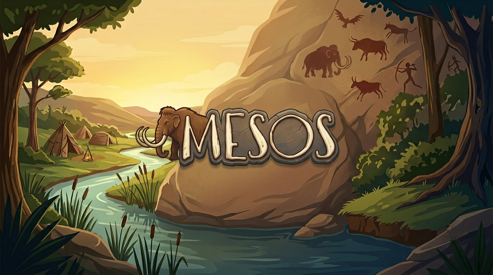
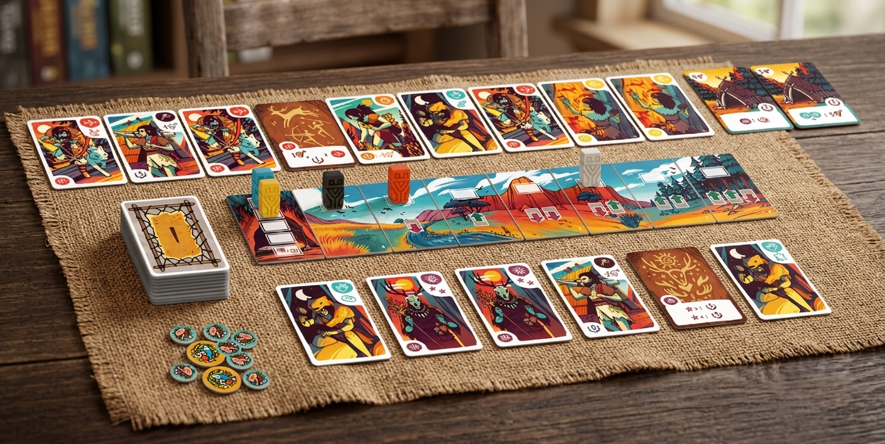

# Mesos – Software Engineering Project 2025/2026




Implementation in Java of the **Mesos** board game (by Cranio Creation) for the *Software Engineering Final Project* course (Politecnico di Milano, A.Y. 2025‑2026).

The project implements a **client–server** system that allows multiple players to play Mesos on the LAN, supporting both a **text-based interface (TUI)** and a **graphical interface (JavaFX GUI)**, with communication over **TCP Sockets** and **RMI**.

---

## Project structure

Main folders of the repository:

- `src/main/java/`
    - Application source code (server, client, network, model, controllers, views)
- `src/test/java/`
    - Unit and integration tests
- `deliverables/`
    - Project documentation and official deliverables:
        - `Documentation/ProtocolDocumentation.pdf` – Client–server protocol documentation
        - `Documentation/SequenceDiagram` – Folder containing sequence diagrams for the client–server communication
        - `DetailedUML` – Detailed UMLs 
        - `HighLevelUML.png` – High-level UML
        - `TestCoverage.png` – Intellij screenshot showing test coverage
        - `Javadoc/` – Javadoc documentation
        - `Jar/` – Executable JAR files for server and client applications
- `pom.xml`
    - Maven configuration file (dependencies, JavaFX setup, shaded jars, Java version)
- `github_assets/`
    - Images used in this README
- `rules/` – Official rulebooks of the Mesos board game

---

## Implemented requirements

| Requirement                                | Implemented |
|--------------------------------------------|:-----------:|
| **Full rules**                             |     ✅      |
| TUI (text-based client)                    |     ✅      |
| GUI (JavaFX graphical client)              |     ✅      |
| Communication via **Socket**               |     ✅      |
| Communication via **RMI**                  |     ✅      |
| Advanced feature: **Match ranking on DB**  |     ✅      |
| Advanced feature: **Multiple matches**     |     ✅      |
| Advanced feature: Persistence              |     ❌      |
| Advanced feature: Resilience               |     ❌      |

Configuration: **Full rules + TUI + GUI + Socket + RMI + 2FA (DB ranking, multiple matches)**

---

## High-level architecture

- **Server**
    - Implemented in Java SE.
    - Manages game rules, match state, lobbies and database access.
    - Simultaneously supports:
        - Socket TCP clients
        - RMI clients
    - Thanks to the `HybridServerNetworkAdapter` component, it supports **mixed matches** (some players via Socket, others via RMI).

- **Client**
    - Implemented in Java SE.
    - Can be started in different modes:
        - TUI or GUI
        - Socket or RMI
    - Each client participates in **one match at a time** and communicates with the server through a `ClientNetworkAdapter`.

- **Persistence and database**
    - External MySQL database used to:
        - store results and statistics of completed matches
        - compute global rankings per number of players

---

## Prerequisites

To run the application using the provided jars:

- **Java 25** (JDK 25) installed and available on the system
- **MySQL** running on the configured host (default: `localhost:3306`)
- A MySQL user with read/write permissions on the database (e.g. `root`)

Database access credentials are read via **environment variables**.

---

## Database environment variables

The server reads DB configuration from the following environment variables:

- `DB_URL` – JDBC URL of the database
    - example: `jdbc:mysql://localhost:3306/GR39_Mesos_DB`
- `DB_USER` – database username
    - example: `root`
- `DB_PASSWORD` – database password
    - example: `<password>`

### macOS / Linux (bash, zsh, etc.)

Set the variables:

```bash
export DB_URL="jdbc:mysql://localhost:3306/GR39_Mesos_DB"
export DB_USER="root"
export DB_PASSWORD="<password>"
```

Check current values:

```bash
env | grep -E "^(DB_URL|DB_USER|DB_PASSWORD)="
```

### Windows (PowerShell)

Set the variables:

```powershell
$env:DB_URL="jdbc:mysql://localhost:3306/GR39_Mesos_DB"
$env:DB_USER="root"
$env:DB_PASSWORD="<password>"
```

Check current values:

```powershell
gci env:DB_URL,env:DB_USER,env:DB_PASSWORD
```

---

## Running the application (JARs)

The build produces two separate jars:

- `mesos-server.jar` – game server
- `mesos-client.jar` – client (TUI/GUI, Socket/RMI)

Make sure DB environment variables are set **before** starting the server.

### 1. Starting the server

The server **does not require any command-line parameters**:

```bash
java -jar mesos-server.jar
```

### 2. Starting the client

The client requires parameters to specify interface and protocol:

```bash
java -jar mesos-client.jar gui/tui rmi/socket <server-ip>
```

- `gui/tui` – UI type:
    - `gui` for the JavaFX graphical interface
    - `tui` for the text-based terminal interface
- `rmi/socket` – communication protocol:
    - `rmi` to use RMI
    - `socket` to use TCP sockets
- `<server-ip>` – server address:
    - `localhost` if client and server run on the same machine
    - or the IP / hostname of the remote server

**Examples:**

- GUI client over Socket on the same machine:

  ```bash
  java -jar mesos-client.jar gui socket localhost
  ```

- TUI client over RMI to a remote server:

  ```bash
  java -jar mesos-client.jar tui rmi 192.168.1.100
  ```

---

## Authors

- Luca Sciarini
- Edoardo Sacchi
- Leonardo Taccari
- Daniel Russo